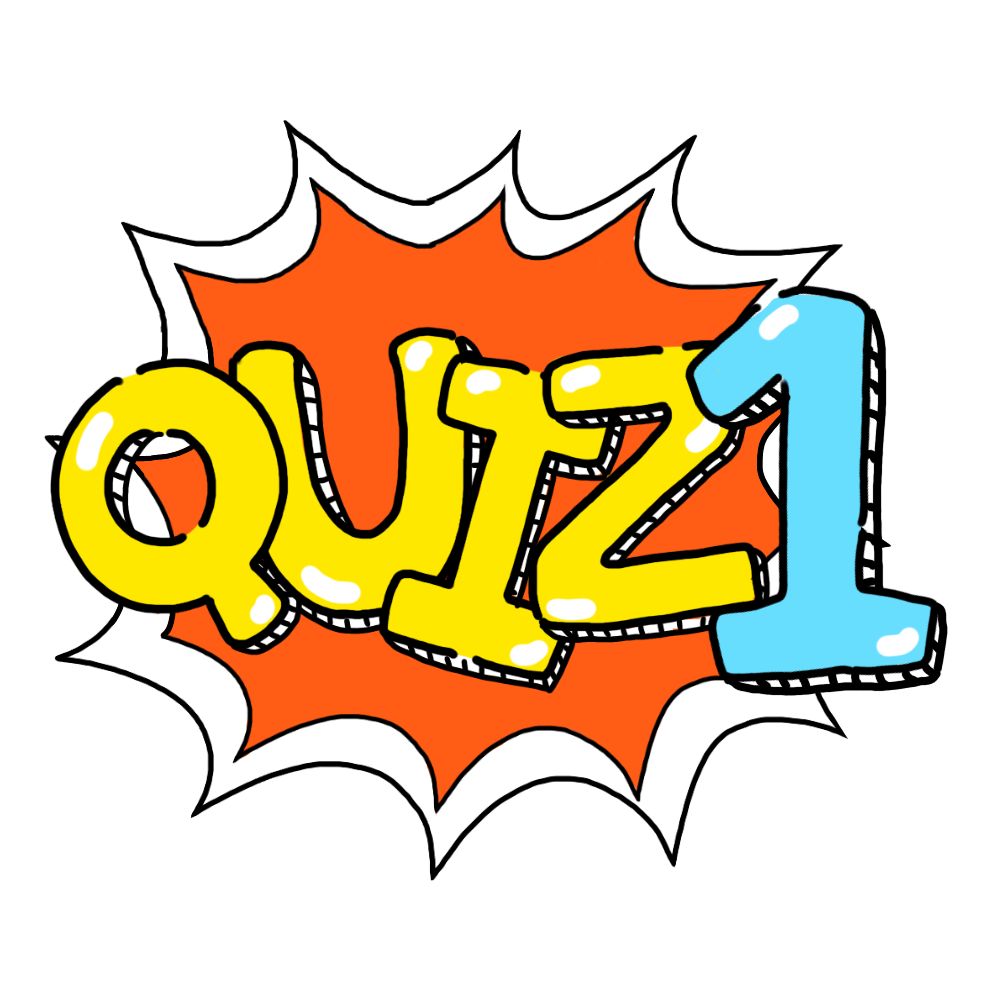

# quiz

Vanila JS를 사용하여 제작한 포트폴리오 페이지입니다. <br>
작성한 답을 LocalStorage에 저장한 후 JSON 파일에 있는 정답과 비교하여 마지막 결과 페이지에 출력할 수 있도록 코딩했습니다. <br>
또한 PWA로 구현하여 앱을 설치할 수 있습니다.

<br>


## ⚙️ 개발환경

Javascript, html, scss

<br>


## ✒️ 코드 리뷰

main.html, quiz.html, index.html 3가지 html 파일을 만들어<br>
버튼 클릭 시 a 태그를 사용하여 메인화면, 퀴즈화면 (10개), 결과화면으로 넘어가도록 구현하였습니다.

```html
// main.html

<div id="container" class="main">
  <div class="inner">
    <div class="first_page flex_center">
      <h1></h1>
      <p style="margin-bottom: 10px;">모든 정답은 띄어쓰기 없이 작성해주세요</p>
      <h3>당신의 이름은?</h3>
      <input
        id="name"
        type="text"
        placeholder="이름을 작성하세요"
        onfocus="this.placeholder=''"
        onblur="this.placeholder='이름을 작성하세요'"
      />
      <a href="./quiz.html" class="btn start_btn">시작하기</a>
    </div>
  </div>
</div>
```

<br>


index.html에서 사용되는 js파일입니다.<br>
input box에 입력받은 이름을 names라는 변수에 저장한 후 다시 LocalStorage에 저장합니다.


```js
// index.js

let names; // 사용자 이름을 기억하는 변수
let inputBox = document.getElementById("name");
const startBtn = document.querySelector(".start_btn");

startBtn.addEventListener("click", () => {
  names = inputBox.value;
  
  window.localStorage.setItem("name", names);

  inputBox.value = "";
})
```

<br>

h3 태그에 quizList.js파일에 작성되어 있는 문제가 랜덤으로 출력되도록 코딩하였습니다.<br>
퀴즈 내용은 id, question, answer 3개의 key값으로 구성되어 있습니다.<br>

```html
// quiz.html

<div id="container" class="quiz">
<div class="inner">
  <div class="quiz_page flex_center">
    <h1></h1>
    <h2 style="margin-bottom: 10px;"></h2>
    <div class="quiz_wrap">
      <h3>Lorem ipsum dolor, sit amet consectetur adipisicing elit.</h3>
      <input
        id="answer"
        type="text"
        placeholder="정답은?"
        onfocus="this.placeholder=''"
        onblur="this.placeholder='정답은?'"
      />
    </div>
    <a href="#" class="btn next_btn">다음 문제</a>
    <a href="result.html" class="btn result_btn">결과보기</a>
  </div>
</div>
```

setInterval을 사용하여 제한시간을 10초로 설정햤습니다.10초 내로 답을 작성하지 않으면 다음 문제로 넘어갑니다.<br>
문제가 랜덤으로 출력되도록 설정했고, 중복된 문제가 나오게 하지 않게 처리하였습니다.<br>
답변을 저장하는 배열과 퀴즈의 정답을 비교하는 배열 2개를 만들어서 배열의 index끼리 비교하여 결과창을 출력하도록 코딩했습니다.

```js
export * from "./quiz.js";

// quiz.js
import data from "./quizList.js";

const ques = document.querySelector(".quiz_wrap > h3");
const quizImg = document.querySelector(".quiz_img");
const nextBtn = document.querySelector(".next_btn");
const result_btn = document.querySelector(".result_btn");
const answerInput = document.querySelector("#answer");

/**
 * 문제의 번호를 기억하는 변수 (현재 문제를 가리키는 변수)
 */
let index = 0;

/**
 * 점수를 기억하는 변수
 */
let score = 0;

/**
 * 제한시간을 표시하는 변수
 */
let count = 10;

/**
 * 랜덤 문제 저장 배열(10개)
 */
const randomQuizList = new Array(10); //

/**
 * 답 저장 배열
 */
const answerList = new Array(10);

/**
 * 답 비교 배열
 */
const scoreList = new Array(10);

/**
 * 문제 은행에서 랜덤으로 문제를 뽑아서 랜던문제 배열에 저장
 * 실행 시점 : PageLoad()
 */
for (let index = 0; index < randomQuizList.length; index++) {
    const randomNumber = Math.floor(Math.random() * 20); // 난수 발생

    // 중복제거
    if (randomQuizList.indexOf(data[randomNumber]) === -1) {
        randomQuizList[index] = data[randomNumber];
    } else {
        index--;
    }
}

/**
 * 첫번 째 랜덤문제 배열의 질문 표시
 * 실행 시점 : PageLoad()
 */
ques.innerHTML = `${randomQuizList[index].question}`;

/**
 * 남은 시간을 설정하는 Interval Function
 * 실행 시점 : PageLoad()
 */
const intervalId = setInterval(() => {
    if (count === 0) {
        // 다음버튼 및 결과보기 버튼의 표시 유무를 확인하여 이벤트 실행 --
        if (result_btn.style.display != "block") {
            nextBtn.click();
        } else {
            result_btn.click();
        }

        count = 10;
    }

    document.querySelector("h2").innerHTML = `남은 시간 : ${count}`;
    count--;
}, 1000);

/**
 * 다음 문제 버튼 클릭이벤트
 * 실행 시점 : nextBtn Click()
 */
nextBtn.addEventListener("click", (event) => {
    event.preventDefault();

    // 답변 값 저장
    answerList[index] = answerInput.value;
    index++;

    // 결과보기 버튼을 표시할지 말지 결정하는 조건문
    if (index >= randomQuizList.length - 1) {
        nextBtn.style.display = "none";
        result_btn.style.display = "block";
    }

    // 다음 문제 표시
    ques.innerHTML = `${randomQuizList[index].question}`;

    // 답변란 초기화
    answerInput.value = "";

    // 다음 문제에 맞게 퀴즈 이미지 변경
    quizImg.src = "img/quiz" + [index + 1] + ".png";

    // 남은시간 초기화 및 남은 시간 즉시 표시 --
    count = 10;
    document.querySelector("h2").innerHTML = `남은 시간 : ${count}`;
});

/**
 * 결과보기 버튼 클릭 이벤트
 * 실행 시점 : result_btn Click()
 */
result_btn.addEventListener("click", () => {
    answerList[randomQuizList.length - 1] = answerInput.value;

    for (let index = 0; index < answerList.length; index++) {
        if (randomQuizList[index].answer == answerList[index]) {
            score += 10;
            scoreList[index] = true;
        } else {
            scoreList[index] = false;
        }
    }

    window.localStorage.setItem("score", score);
    window.localStorage.setItem("scoreList", JSON.stringify(scoreList));

    clearInterval(intervalId);
});
```

<br>

table 태그를 이용하여 결과값을 간단하게 보여줄 수 있도록 디자인했습니다.

```html
// result.html
<div id="container" class="result">
  <div class="inner">
    <div class="result_page flex_center">
      <h1></h1>
      <div class="result_wrap">
        <h3>ㅇㅇㅇ님의 점수는 xx점 입니다.</h3>
        <br /><br /><br />
        <table>
          <thead>
            <tr class="table_title">
              <td>1</td>
              <td>2</td>
              <td>3</td>
              <td>4</td>
              <td>5</td>
              <td>6</td>
              <td>7</td>
              <td>8</td>
              <td>9</td>
              <td>10</td>
            </tr>
          </thead>
          <tbody>
            <tr class="table_result">
              <td></td>
              <td></td>
              <td></td>
              <td></td>
              <td></td>
              <td></td>
              <td></td>
              <td></td>
              <td></td>
              <td></td>
            </tr>
          </tbody>
        </table>
      </div>
      <a href="index.html" class="btn replay_btn">다시하기</a>
    </div>
  </div>
</div>
```

결과값은 O/X 두 가지로 구분되어 출력되고, h3 태그에 처음 입력한 사용자의 이름과 총 점수를 출력하도록 코딩했습니다.<br>
LocalStorage에 저장되어 있는 내용을 가져와서 화면에 출력합니다.

```js
// result.js

const resultTitle = document.querySelector(".result_wrap > h3"); // 점수(결과)
const resultText = document.querySelector(".result_wrap > p"); // 틀린 문제
const replayBtn = document.querySelector(".replay_btn"); // 다시하기 버튼
const tableResult = document.querySelectorAll(".table_result > td > img");
// const createImage = document.createElement("img");

// locaStorage
const nameString = window.localStorage.getItem("name");
const resultString = window.localStorage.getItem("score");
const scoreString = JSON.parse(window.localStorage.getItem("scoreList"));
// console.log(scoreString);

resultTitle.innerHTML = `${nameString}님의 점수는 ${resultString}점 입니다.`;

tableResult.forEach((item, index) => {
  
  item.innerHTML = `${scoreString[index]}`;
  if (scoreString[index]) {
    item.src = "img/o.png";
  } else {
    item.src="img/x.png"
  }
})

replayBtn.addEventListener("click", () => {
  localStorage.clear();
});

```

<br>


## PWA
sw-precache를 사용하여 캐시를 저장하고 오프라인에서도 접속할 수 있도록 코딩했습니다.<br>
sw-precache는 캐시 가능한 모듈을 만들어 주는 라이브러리입니다.<br>
sw-precache-config.js 파일을 생성한 후 아래와 같이 작성합니다.

```js
module.exports = {
  staticFileGlobs: [
    "index.html",
    "main.html",
    "quiz.html",
    "result.html",
    "css/*.css",
    "img/**.*",
    "js/**.*"
  ],
};
```

작성하고 나면 <code>$ sw-precache --config sw-config.js</code>를 이용하여 설정을 적용시킵니다.<br>
그러면 service-worker.js 파일이 생성되는데, html의 스크립트 부분을 해당 파일명으로 변경한다.

```html
<script>
  if("serviceWorker" in navigator) {
    // 브라우저에 서비스워커가 있을 때 (지원여부)
    navigator.serviceWorker.register("service-worker.js") // 비동기
    .then((success)=>{
      console.log("servieceWorker 설치에 성공했습니다", success);
    })
  }
</script>
````

또한 manifest.json 파일을 추가하여 앱을 다운로드 받을 수 있도록 설정했습니다.<br>
service-worker처럼 manifest.json파일도 html 파일에 연결합니다.

```html
<link rel="manifest" href="./manifest.json">
```

```json
// manifest.json

{
  "short_name": "QUIZ",
  "name": "QUIZ",
  "background_color": "#ff9d1c",
  "icons": [
    {
      "src": "./img/192.png",
      "sizes": "192x192",
      "type": "image/png"
    },
    {
      "src": "./img/512.png",
      "sizes": "512x512",
      "type": "image/png"
    }
  ],
  "start_url": "./index.html",
  "display": "standalone",
  "theme_color": "#ff9d1c",
  "orientation": "portrait",
  "discription": "PWA 퀴즈"
}

```
<br>
